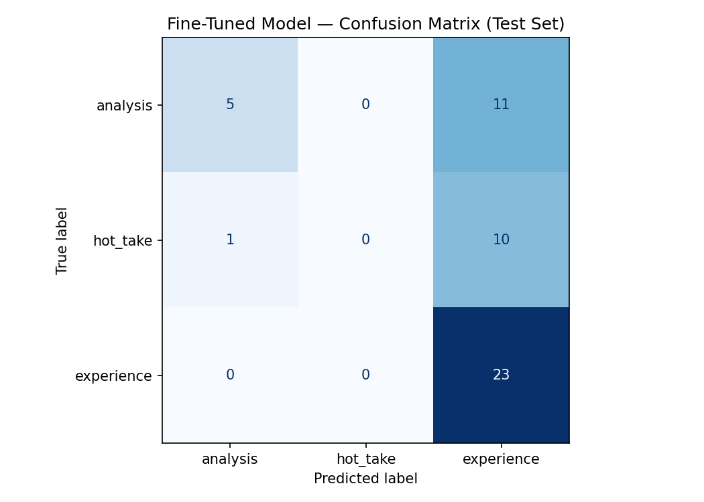

# TakeMeter

A fine-tuned text classifier that labels posts from online content creator communities as `analysis`, `hot_take`, or `experience`. Built as a project for AI201.

---

## Community

Reddit communities: r/contentcreation, r/ContentCreators, r/creators, r/NewTubers.

These communities mix structured arguments about platform strategy, bold unsupported opinions, and personal creator stories — enough variation to make classification non-trivial, and a space I personally know well enough to annotate reliably.

---

## Labels

**`analysis`** — the post makes a structured argument about content creation strategy, platform behavior, or the industry, with specific reasoning or evidence. The point could stand on its own even without the author's personal feelings.

> *"Starting from zero is slower than it was in 2018 — the feedback loops are longer and algorithms need more data before pushing your content."*

**`hot_take`** — a bold, confident opinion about content creation stated with little or no supporting argument. The claim might be true, but the post asserts rather than reasons.

> *"Content creation is the hardest business model."*

**`experience`** — a personal story or account from someone's creator journey. The post is primarily about what happened to them, not making a general argument.

> *"Quit my corporate job 8 months ago to do content full time — here's the honest reality."*

**Edge case rule:** if a post shares a personal story AND makes a broader argument, ask what the PRIMARY purpose is. Mostly storytelling → `experience`. Mostly arguing a general point → `analysis`.

---

## Dataset

| Split | Examples |
|-------|----------|
| Train | 232 |
| Validation | 50 |
| Test | 50 |
| **Total** | **332** |

Label distribution across the full dataset:

| Label | Count | % |
|-------|-------|---|
| experience | 157 | 47% |
| analysis | 103 | 31% |
| hot_take | 72 | 22% |

Posts were collected from Reddit via public RSS feeds (no API key required) across multiple subreddits and sort orders (top/month, top/year, top/all). Question and help-request posts were filtered out using keyword patterns. Each post was pre-labeled using Groq (llama-3.1-8b-instant) and then reviewed and corrected manually before use.

---

## Models

**Zero-shot baseline:** Groq API (`llama-3.1-8b-instant`) with a prompt containing the label definitions and the edge case rule. No training — the model classifies from the prompt alone.

**Fine-tuned model:** `distilbert-base-uncased` with a 3-class classification head, fine-tuned for 3 epochs on the 232-example training set using the HuggingFace `Trainer` API on a T4 GPU.

---

## Results

| Model | Accuracy |
|-------|----------|
| Zero-shot baseline (Groq) | **0.600** |
| Fine-tuned DistilBERT | **0.560** |

Fine-tuning produced a **regression of 0.040** relative to the baseline.

### Per-class F1 scores

| Label | Baseline F1 | Fine-tuned F1 |
|-------|-------------|---------------|
| analysis | 0.58 | 0.45 |
| hot_take | 0.43 | **0.00** |
| experience | 0.65 | 0.69 |

### Confusion matrix (fine-tuned model)



The matrix shows the core failure clearly: the fine-tuned model predicted **zero hot_takes** across all 50 test examples. Every hot_take in the test set was classified as either `analysis` (1) or `experience` (10). The model also mislabeled 11 of 16 `analysis` posts as `experience`. It essentially collapsed to predicting `experience` for anything ambiguous.

---

## Error Analysis

**Why the fine-tuned model failed on hot_take:**

`hot_take` was the smallest class at 22% of the dataset (~50 training examples after the 70/15/15 split). DistilBERT didn't see enough examples of the class to learn its surface features. Instead, it defaulted to `experience` — the majority class — whenever it was uncertain. This is a classic symptom of class imbalance in small training sets.

The zero-shot baseline handled `hot_take` much better (F1=0.43) because Groq could reason from the label definition in the prompt — "bold opinion with little supporting argument" — without needing to have seen labeled examples.

**Three representative errors from the fine-tuned model:**

1. *"Never doing critiques again"* — True: `hot_take`, Predicted: `experience`. The post opens with a personal story about a bad critique experience but the title alone is a bold assertion. The model latched onto the narrative structure and missed the declarative claim.

2. A post asserting that a specific platform strategy is universally wrong — True: `analysis`, Predicted: `experience`. The argument was framed in first person ("I've found that…"), which likely triggered the experience pattern.

3. A post comparing monetization strategies across platforms with data — True: `analysis`, Predicted: `experience`. The model struggled with analytical posts written in an informal, personal register.

**Pattern:** the fine-tuned model over-relied on surface cues (first-person framing, narrative structure) rather than learning the underlying distinction between asserting vs. reasoning vs. recounting.

---

## Definition of Success

I defined success as a per-class F1 of **0.65 or higher on all three labels**. The fine-tuned model did not meet this bar — it reached 0.69 on `experience` but failed entirely on `hot_take`. The baseline came closer overall (macro F1: 0.55 vs. 0.38) but also fell short of 0.65 on `analysis` and `hot_take`.

The most likely path to improvement: collect more `hot_take` examples to balance the dataset (targeting 100+ per class), and possibly weight the loss function to penalize mistakes on minority classes during training.

---

## AI Tool Usage

AI tools were used in three places, consistent with the plan in `planning.md`:

**Pre-labeling:** Groq (`llama-3.1-8b-instant`) was used to generate a first-pass label for each post using the label definitions as a prompt. Every pre-assigned label was reviewed and corrected manually before the CSV was used for training. Labels that couldn't be verified were removed.

**Zero-shot baseline:** The same Groq model was used as the zero-shot comparator in Section 5 of the notebook, using the same label definitions as a system prompt.

**Error pattern analysis:** Claude (Anthropic) was used to help identify patterns in the wrong predictions after evaluation. All patterns were verified by re-reading the examples before being written into this report.

No AI-generated content appears in the labeled dataset without human review. All evaluation numbers are computed from model outputs, not estimated.

---

## Files

```
README.md                          — this file
planning.md                        — label definitions, data plan, success criteria
takemeter_dataset.csv              — final labeled dataset (332 examples)
collect_and_prelabel.py            — data collection + pre-labeling script
confusion_matrix.png               — confusion matrix for fine-tuned model
evaluation_results.json            — accuracy and improvement numbers
Copy_of_ai201_project3_takemeter_starter_clean.ipynb  — training notebook
```
